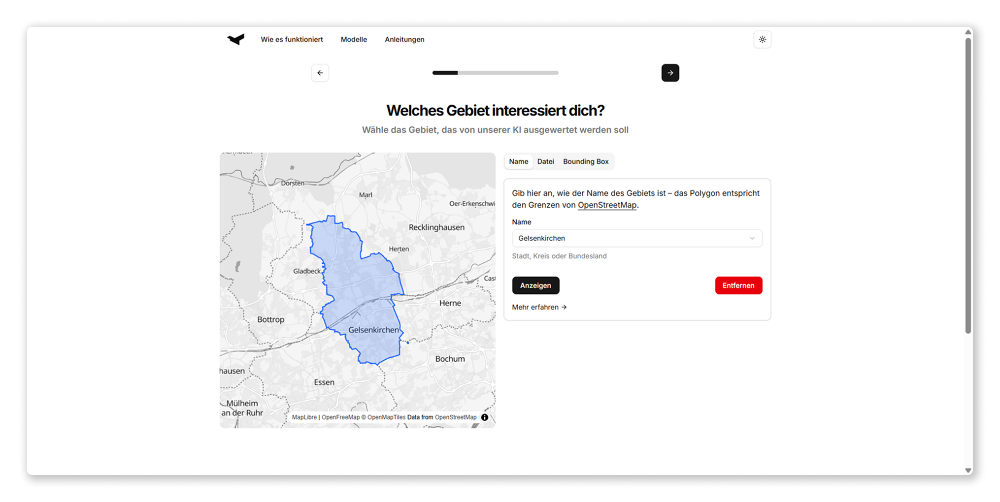

<div align="center">

<picture>
  <source media="(prefers-color-scheme: dark)" srcset="https://www.github.com/geospaitial-lab/aviary/raw/main/docs/assets/aviary_logo_white.svg">
  
</picture>

</div>

The Assistant is a web app that helps users configure their [aviary] pipeline.

<div align="center">
  
  <br />
  <a href="https://geospaitial-lab.github.io/aviary-assistant" target="_blank" rel="noopener noreferrer">https://geospaitial-lab.github.io/aviary-assistant</a>
</div>

  [aviary]: https://github.com/geospaitial-lab/aviary

---

## Local Development

Install the dependencies:

```bash
npm install
```

---

Start the development server:

```bash
npm run dev
```

---

## License

aviary-assistant is licensed under the [GPL-3.0 license].

  [GPL-3.0 license]: LICENSE.md
